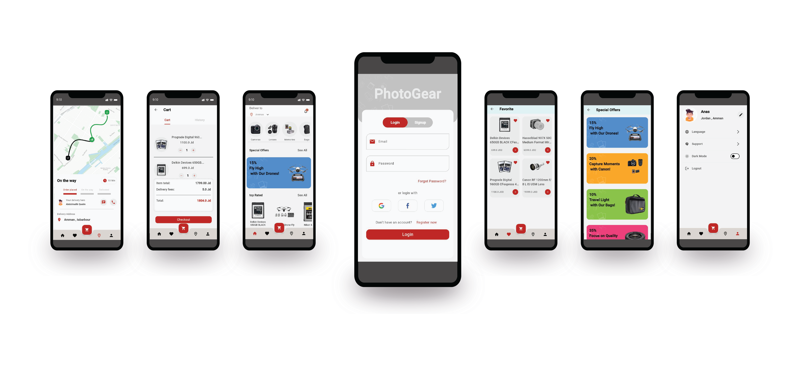

# PhotoGear

Welcome to the PhotoGear Store! This application is designed to provide an exceptional shopping experience for all your photography needs. Explore a wide range of cameras and photographic equipment with a beautifully designed, user-friendly interface.

## Features

- **Intuitive & User-Friendly Interface:** Navigate effortlessly through a clean and beautifully crafted UI, making your shopping experience enjoyable and straightforward.

- **Secure Authentication:** Firebase authentication ensures your data's security, with Google Sign-In for quick and easy access.

- **Effortless Product Browsing:** Easily browse through a vast collection of cameras and photographic equipment, with real-time updates and dynamic data management.

- **Seamless Shopping Experience:** Add items to your cart, view details, and proceed with a smooth checkout process.

- **Dark & Light Themes:** Customize your viewing experience with both dark and light themes, perfect for any lighting condition.

- **Arabic & English Support:** Enjoy full support for both Arabic and English, ensuring a comfortable shopping experience in your preferred language.

## Demo

## Installation

1. Clone this repository using `git clone https://github.com/anasAlmadmouj/photogear_app`
2. Navigate to the project directory: `cd photogear_app`
3. Install dependencies: `flutter pub get`
4. Run the app: `flutter run`

## Dependencies

This app utilizes the following dependencies:

- **shared_preferences: ^2.2.0** - Facilitates data persistence by allowing you to store simple key-value pairs on the device.

- **toggle_switch: ^2.1.0** - Provides customizable toggle switches for your app's UI.

- **flutter_bloc: ^8.1.3** - Integrates the BLoC (Business Logic Component) pattern seamlessly into your Flutter app, streamlining state management and UI interactions.

- **bloc: ^8.1.2** - Provides a powerful and flexible state management solution for your Flutter app, enhancing code organization and UI updates.

- **dotted_border: ^2.0.0+3** - Adds dotted borders to widgets, allowing for more creative UI designs.

- **flutter_credit_card: ^3.0.7** - Implements credit card input forms with an attractive and user-friendly design.

- **smooth_page_indicator: ^1.1.0** - Provides smooth and customizable page indicators for page views.

- **animated_splash_screen: ^1.3.0** - Creates a dynamic and visually appealing splash screen for your app.

- **flutter_localization: ^0.1.14** - Supports internationalization and localization, making your app accessible to users from various regions with different languages.

- **flutter_screenutil: ^5.9.3** - Provides responsive screen size and adaptation utilities, ensuring a consistent and optimized UI across different devices.

- **introduction_screen: ^3.0.2** - Implements an introduction screen with customizable slides to introduce your app's features to new users.

---

### Designed and developed by [Anas Almadmouj](https://www.linkedin.com/in/anas-al-madmouj-0979271aa/).
